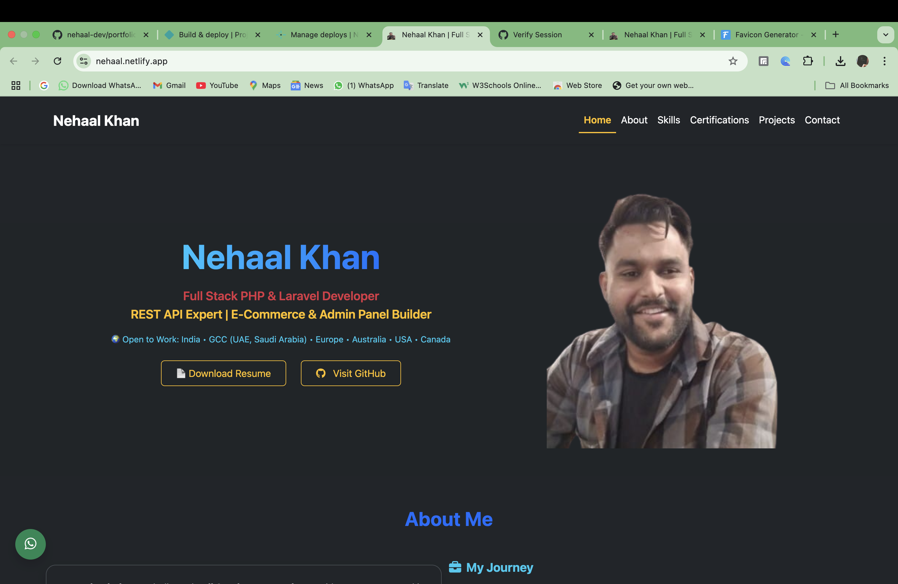

# 🚀 Nehaal Khan – Developer Portfolio

🎯 A fully responsive and animated **Developer Portfolio Website** built using `HTML5`, `CSS3`, `Bootstrap 5`, `JavaScript`, and `Animate.css`.  
Live Demo → [https://nehaal.netlify.app/](https://nehaal.netlify.app/)

---

## 👨‍💻 About Me

Hi, I’m Nehaal Khan– a passionate  Full Stack PHP Developer** with expertise in:

- Core PHP & Laravel
- MySQL & REST API
- Bootstrap, JS, AJAX
- E-commerce, Travel Portals, CRM Dashboards

I love building scalable backends and clean frontends that solve real-world business problems.

---

## 🛠 Tech Stack

- Frontend**: HTML5, CSS3, Bootstrap 5, JavaScript, Animate.css  
- Backend**: Core PHP, Laravel  
- Database**: MySQL  
- Tools**: VS Code, Git, GitHub, Netlify  

---

## 📂 Live Portfolio

🌐 Visit: [https://nehaal.netlify.app/](https://nehaal.netlify.app/)

---

## 📸 Screenshot

---

## 📬 Contact Me

- 📧 Email: [nehalkhan4639@gmail.com](mailto:nehalkhan4639@gmail.com)
- 💼 LinkedIn: [Nehaal Khan](https://www.linkedin.com/in/nehaal-khan-225b0b259)
- 🐙 GitHub: [@nehaal-dev](https://github.com/nehaal-dev)
- 💬 WhatsApp: [Click to Chat](https://wa.me/919794485787)

---

## 🔐 License

This project is licensed for educational and personal use.