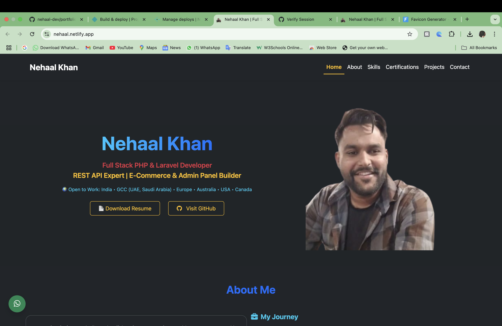

# 🚀 Nehaal Khan — Full Stack PHP Laravel Developer
 
 

> A fully responsive **Developer Portfolio Website** built with HTML5, CSS3, Bootstrap 5, JavaScript, and Animate.css.

🌐 **Live Portfolio → [https://nehaal.netlify.app/](https://nehaal.netlify.app/)**

---

## 👨‍💻 About Me

Hi, I'm **Nehaal Khan** — a Full Stack PHP Laravel Developer with hands-on experience building real-world web applications.

I specialize in:
- **Laravel** — MVC architecture, REST API, Eloquent ORM, Middleware
- **PHP** — Core PHP, OOP, MVC pattern
- **MySQL** — Database design, migrations, relationships
- **Frontend** — Blade Templates, Tailwind CSS, Bootstrap 5, JavaScript
- **Integrations** — Stripe payment, Gmail SMTP, Sanctum API auth
- **Deployment** — Railway.app, Netlify, Git/GitHub

---

## 🛠 Tech Stack

| Category | Technologies |
|----------|-------------|
| Backend | Laravel 11, PHP 8.3, Core PHP |
| Frontend | Blade, Tailwind CSS, Bootstrap 5, JavaScript |
| Database | MySQL |
| Auth | Laravel Breeze, Sanctum |
| Tools | VS Code, Git, GitHub, Postman |
| Deploy | Railway.app, Netlify |

---

## 💼 Featured Projects

### 🧾 1. Invoice Portal — SaaS Invoice Management System
A production-ready SaaS application built with Laravel 11.

**Live:** [https://web-production-15ad2e.up.railway.app](https://web-production-15ad2e.up.railway.app)
**GitHub:** [github.com/nehaal-dev/invoice_portal](https://github.com/nehaal-dev/invoice_portal)

**Key Features:**
- Client & Invoice Management (CRUD)
- PDF Generation (DomPDF)
- Stripe Payment Integration
- Email Notifications with PDF attachment
- REST API with Sanctum authentication
- Subscription Plans (Free/Pro)
- Client Portal with role-based access
- Search & Filter on invoices
- Deployed on Railway.app with MySQL

**Tech:** Laravel 11, PHP 8.3, MySQL, Tailwind CSS, Stripe, Gmail SMTP

---

### 👑 2. KidsCrown.in — Dental E-Commerce Web Application
A full-featured e-commerce web application for a dental products company specializing in stainless steel crowns for children's teeth (deciduous teeth).

**Live:** [https://kidscrown.in](https://kidscrown.in)

**Key Features:**
- Product catalog with categories (Crowns, Resources, Downloads)
- Shopping cart and order management
- Doctor/user registration and login system
- Order placement — dentists order crowns for child patients
- Product comparison system
- Contact and inquiry management
- Admin panel for product and order management

**Tech:** Core PHP, MySQL, Bootstrap, JavaScript, HTML5, CSS3

---

### 🏢 3. SetuSpace.com — Coworking Space Booking Website
A responsive website for a coworking space provider in Noida, with space booking and inquiry features.

**Live:** [https://setuspace.com](https://setuspace.com)

**Key Features:**
- Responsive landing page with modern UI
- Space booking system (Hot Desk, Day Pass, Meeting Room)
- Contact form with email handling (PHP Mailer)
- Gallery, testimonials, blog sections
- Pricing and FAQ pages
- Location-based space finder

**Tech:** HTML5, CSS3, JavaScript, PHP, Email Handling

---

## 📂 Live Portfolio

🌐 **[https://nehaal.netlify.app/](https://nehaal.netlify.app/)**

---

## 📸 Screenshot

---

## 📬 Contact

| Platform | Link |
|----------|------|
| 📧 Email | [nehalkhan4639@gmail.com](mailto:nehalkhan4639@gmail.com) |
| 💼 LinkedIn | [Nehaal Khan](https://www.linkedin.com/in/nehaal-khan-225b0b259) |
| 🐙 GitHub | [@nehaal-dev](https://github.com/nehaal-dev) |
| 💬 WhatsApp | [Click to Chat](https://wa.me/919794485787) |

---

## 🔐 License

This project is licensed for educational and personal use.
